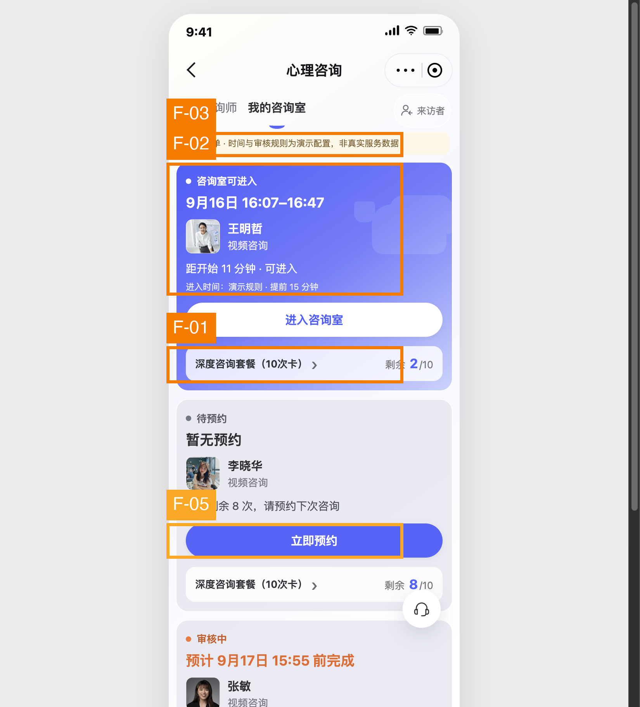
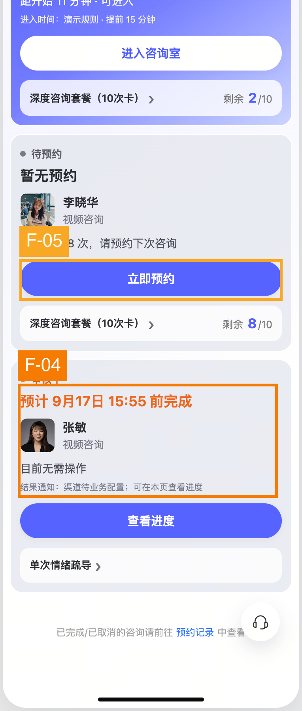
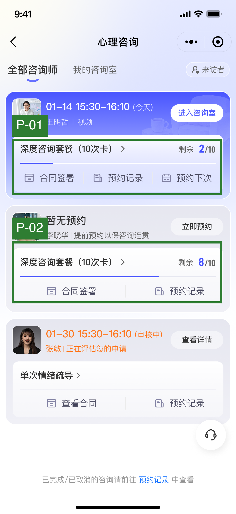

# 预约列表改版对比 UX 审计

## 执行摘要

图 1、图 2 是修改后同一页面的上下部分，图 3 是原版；评估目标仍是让用户迅速了解订单状态，并进入已预约咨询。新版修正了“我的咨询室”的选中态，也让可进入状态更清楚，但卡片显著变长、用语重复，并隐藏了原版直接可见的进度条和功能入口。最优先应恢复套餐进度与快捷入口、删去演示/配置文案及重复说明、让审核卡重新显示所申请的咨询时段。待预约按钮应弱化，但保留清晰可点的操作提示。用户已明确决定本轮不修改客服悬浮按钮和底部历史记录入口，二者不计入待修发现。所有结论只依据截图可见内容，不推断真实点击、通知或后台规则。

## 范围与证据

- **用户目标：** 混合用户查看已下单订单状态，快速进入已预约的心理咨询。
- **页面归属：** 按产品方此前澄清，页面属于“我的咨询室”；新版的选中态与归属一致，不再重复旧审计中已撤销的导航问题。
- **图 1：** 修改后页面上半部分，含导航、可进入卡、待预约卡与审核卡开头。
- **图 2：** 修改后同一页面下半部分，含待预约、审核、历史记录与客服入口；与图 1 有重叠，不代表第二个流程步骤。
- **图 3：** 原版完整页面，作为功能可见性与信息层级对照。
- **方法：** 目标走查 + Nielsen、Shneiderman、G-P、Bastien & Scapin、Gestalt、Norman、Fogg B=MAP、Fitts、WCAG 静态子集与内容设计启发式。严重度按核心目标受影响程度、触达人数和重复频次评定。
- **无法判断：** 按钮真实热区、点击反馈、页面加载、通知是否实际发出、审核预计时间是否真实可靠、咨询室开放规则、屏幕阅读器与大字体表现。
- **本轮不改：** 客服悬浮按钮位置、底部历史记录入口。不得把它们作为此次代码修改项。

## 发现总览

| ID | 优先级 | 性质 | 问题 | 依据 |
|---|---|---|---|---|
| F-01 | S3 高 | 必须修复的改版回归 | 套餐进度条及合同、预约记录、预约下次等入口由卡片直接可见变为不可见 | Nielsen #6/#7；Tog: Discoverability |
| F-02 | S3 高 | 必须修复的改版回归 | 新卡重复表达状态，文本过多，拉长关键任务路径 | Nielsen #8；G-P #8；Content #9 |
| F-03 | S3 高 | 新增问题 | 演示规则与未配置渠道等内部语言直接暴露给用户 | Nielsen #2；Content #7；B&S: Significance of codes |
| F-04 | S3 高 | 新增问题 | 审核卡突出预计完成时间，却不显示原版可见的申请咨询时段 | Nielsen #1/#6；G-P #2；Content #1 |
| F-05 | S2 中 | 必须修复的改版回归 | 待预约按钮与紧急“进入咨询室”同样抢眼 | Nielsen #8；Gestalt: Similarity；Fogg B=MAP |

## 标注截图

### 修改后上半部分（图 1）

### 修改后下半部分（图 2）

### 原版参照（图 3）

## 逐项问题

### F-01｜恢复原版直接可见的进度与快捷入口

- **当前问题 →** 图 3 的套餐模块同时显示剩余次数、进度条，以及“合同签署/查看合同”“预约记录”“预约下次”等入口；图 1、2 的新卡只保留一行套餐名与剩余次数。用户已确认：该行的右箭头表示点击后进入**套餐详情页**，不是展开或收起。截图不能证明其他功能已被删除，但它们在列表卡片内已不可见。
- **用户影响 →** 想查合同、咨询记录、下一次预约或消耗进度的人，可能需要先进入套餐详情页再寻找；原本一眼可见的信息增加了操作步骤，消耗进度也难以直观判断。
- **推荐交互方案 →** 保留套餐名与右箭头作为进入套餐详情页的入口，同时恢复原版套餐模块的细进度条和按状态适用的快捷入口。入口标签可保留“合同”“预约记录”“预约下次”，不能一律藏到套餐详情页或“更多”；如果个别入口因业务状态不可用，说明原因或仅在该状态不展示。先核对现有跳转逻辑，再恢复可见性，不重做整张卡。
- **优先级 → S3 高，必须修改。** 用户已明确要求保留，且直接影响订单管理路径。**检查：** RECALL-TAX / FAKE-AFFORDANCE。**依据：** Nielsen #6、#7；Tog: Discoverability；Norman: Signifiers。

### F-02｜卡片重复说明过多，应删减而非继续叠加

- **当前问题 →** 图 1 首卡同时出现“咨询室可进入”“距开始 11 分钟·可进入”“进入时间：演示规则·提前 15 分钟”以及“进入咨询室”按钮；图 1、2 的待预约卡同时出现“待预约”“暂无预约”“套餐剩余 8 次，请预约下次咨询”“立即预约”。多行传达的是同一状态或同一行动。
- **用户影响 →** 三张卡被显著拉长，审核卡在图 1 的首屏仅露出开头；用户为确认所有订单状态需要更多滚动。重复文案也让真正关键的信息——时间、咨询师、主动作——失去焦点。
- **推荐交互方案 →** 每卡按“状态 + 一条关键时间/说明 + 咨询师 + 动作 + 原有套餐模块”组织。首卡可用“今天 16:07–16:47 · 可进入”，删去第二次“可进入”和常驻规则说明；待预约卡保留“暂无预约 + 咨询师 + 剩余 8/10 次 + 预约入口”，去掉同义的状态句。开放规则只在按钮不可用、用户询问或详情页中解释。
- **优先级 → S3 高，必须修改。** 高频页面整体扫描效率下降。**检查：** OVERLOAD / HIERARCHY-FLAT。**依据：** Nielsen #8；G-P #8；Content #4/#9；B&S: Workload。

### F-03｜内部配置/演示文案不应出现在用户界面

- **当前问题 →** 图 1 顶部出现“样例订单·时间与审核规则为演示配置，非真实服务数据”，首卡出现“进入时间：演示规则·提前 15 分钟”；图 2 审核卡出现“结果通知：渠道待业务配置；可在本页查看进度”。
- **用户影响 →** 如果这是面向用户的页面，用户无法判断预约与审核信息是否可信；“渠道待业务配置”也无法回答究竟会不会收到通知。它还与心理咨询场景所需的确定性、可信度相冲突。若当前仅是开发演示环境，则这项是发布前检查，不应直接推断生产环境也会展示。
- **推荐交互方案 →** 演示环境提示仅留在开发/预览工具层，不进入真实用户页面。上线时使用真实规则驱动的文案，例如“咨询开始前 15 分钟可进入”；若规则尚未确定，不展示未经确认的数字。通知方式未配置时仅说“可在本页查看审核进度”，不要承诺渠道，也不要暴露配置状态。
- **优先级 → S3 高，面向用户发布前必须修改。** **检查：** JARGON-LEAK / TRUST-GAP。**依据：** Nielsen #2；Content #7/#8；B&S: Significance of codes。

### F-04｜审核卡丢失申请的咨询时段

- **当前问题 →** 图 3 审核卡上方显示“01-30 15:30–16:10（审核中）”；图 2 的新版审核卡用大号橙字显示“预计 9月17日 15:55 前完成”，却没有展示申请的是哪天、哪个时段。
- **用户影响 →** 用户只知道何时可能得到审核结果，却无法在列表里核对自己申请的咨询时间；多笔申请时更难辨认订单，还可能误把“预计完成时间”看作咨询时间。
- **推荐交互方案 →** 把“申请咨询：日期 + 时段”放在审核卡的主要信息位，紧随“审核中”；预计完成时间降为一行次级说明，并清楚标注“审核预计”。若审核时间无法承诺，显示“正在审核，可查看进度”而非精确时间。
- **优先级 → S3 高。** 影响订单识别和时间判断。**检查：** RECALL-TAX / HIERARCHY-FLAT。**依据：** Nielsen #1、#6；G-P #2；Content #1/#7。

### F-05｜待预约 CTA 需要弱化，但不能失去可操作性

- **当前问题 →** 图 1、2 的“立即预约”是占满卡片宽度的高饱和蓝色实心按钮，与真正时间敏感的“进入咨询室”一样具有强主操作权重；原版图 3 使用较小的浅色按钮。
- **用户影响 →** 用户刚进入页面时容易被次紧急任务吸引，而非先处理即将开始的咨询；页面多个大按钮也延长纵向长度。
- **推荐交互方案 →** 把“立即预约”恢复为卡片内的浅底/描边次级按钮，或与“暂无预约”同一行靠右，确保仍有明确触控区域。仅当用户没有即将开始的预约、且待预约是唯一当前待办时，才考虑提升其权重。不要将预约入口完全隐藏。
- **优先级 → S2 中，用户指定必须修改。** **检查：** CTA-AMBIGUITY / HIERARCHY-FLAT。**依据：** Nielsen #8；Gestalt: Similarity；Fogg B=MAP（Prompt 应与任务紧迫度匹配）。

## 操作路径与交互机会

**查看订单状态：** 新版“我的咨询室”选中态更准确，状态标签也更清楚；但卡片内容加长后，用户要滚动更多才能看到审核状态，而审核卡反而缺少申请时段。建议让一张卡只回答“是什么订单、当前什么状态、现在做什么”，次级说明进入详情，保留套餐进度与常用入口在卡片上。

**进入已预约咨询：** 新版把“可进入”和相对时间放出来，是有效的改进。建议只保留一次“可进入”表达，进入规则只在未开放时解释；点击后的加载、权限、咨询师未就绪和重试仍需真机验证，不能从静态图判断。

**Fogg B=MAP：** 用户进入咨询的动机明确；“进入咨询室”的提示可见，能力成本主要来自冗余文本和入口分散。待预约的强提示出现得比任务紧迫性更高，可能抢走当下注意力。审核卡的预计时间本可降低不确定性，但必须同时保留申请时间并使用可信的真实规则。

## 做得好的地方

- **P-01：** 新版正确突出“我的咨询室”的选中态，纠正原图的状态错误；符合 Nielsen #1/#4。
- **P-02：** 新版对首卡增加“距开始 11 分钟”以及明确的“可进入”状态，比原版只标“今天”更利于把握时机；符合 Nielsen #1、Tog: Anticipation。
- **P-03：** 新版审核卡明确提示“目前无需操作”，这个方向能减少用户猜测；保留该结论即可，不需要同时展示未配置的通知说明。符合 G-P #2。
- **P-04：** 原版的套餐进度条和快捷入口支持快速查看与操作，应在新版中保留；符合 Nielsen #6/#7。

## 优先落实

1. **先止损：** 恢复套餐进度条和原有功能入口，同时压缩重复状态文字，让首屏能看到更多订单。
2. **发布前修正：** 清掉演示与未配置文案；审核卡恢复申请咨询时段，将预计完成时间降为次级信息。
3. **层级调整：** 待预约按钮弱化为次级操作。客服悬浮按钮和历史入口保持现状，不纳入此次修改。

## 框架覆盖

| 框架 | 对应问题 |
|---|---|
| Nielsen | F-01 至 F-05 |
| Shneiderman | F-01、F-04 |
| Gerhardt-Powals | F-02、F-04 |
| Bastien & Scapin | F-02、F-03 |
| Hick / Fitts / Fogg | F-05，另见路径诊断 |
| Cialdini | 无充分可见证据，不强行套用 |
| Gestalt | F-05 |
| Norman | F-01 |
| Tognazzini | F-01、F-02 |
| WCAG 静态子集 | 本次无充分证据支持独立发现 |
| 内容设计 | F-02、F-03、F-04 |

## 不可由截图判断

真实跳转是否仍存在、进度条是否仅被视觉隐藏、按钮实际热区、点击反馈、加载与失败状态、权限请求、咨询室进入条件、通知渠道、审核 SLA 是否可靠、屏幕阅读器语义与焦点、放大字体后的布局。

## 框架参考

Nielsen: nngroup.com/articles/ten-usability-heuristics · Shneiderman: cs.umd.edu/users/ben/goldenrules.html · Gerhardt-Powals: Int. J. HCI (1996) · Bastien & Scapin: INRIA RT-0156 (1993) · Fogg: behaviormodel.org · Norman: jnd.org · Tognazzini: asktog.com/atc/principles-of-interaction-design · WCAG: w3.org/WAI/WCAG21/quickref · Content design: contentdesign.london
