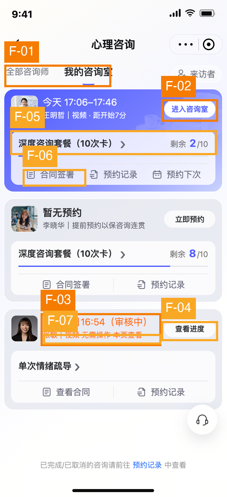

# 预约列表最新版本：截图与本地页面 UX 复查

## 执行摘要

本版已解决上轮最明显的卡片冗长问题：套餐进度条和原有快捷入口恢复，待预约按钮降为次级，首卡的时间与“进入咨询室”也更易扫描。但用户的两个核心目标仍有缺口：审核卡依然未在列表呈现申请咨询的日期/时段；在本地页面里，“全部咨询师”选中后仍展示同一组个人订单，导航状态和内容不一致。进入咨询、预约、记录、合同等入口目前是明确标注未接入的演示流程，不能把本地预览当作真实任务已可完成。审核进度和套餐详情虽能打开，所提供的信息也尚不足以支撑各自的名称与用户目标。

## 范围与方法

- **目标与用户：** 心理咨询微信小程序，混合用户了解已下单订单状态，并快速进入已预约咨询。
- **证据：** 用户提供的最新截图 `current.png`；2026-09-16 对 `http://localhost:4173/` 的只读及非提交式交互走查。
- **实际走查：** 切换“全部咨询师/我的咨询室”；打开套餐详情并返回；打开预约记录、合同签署、预约、进入咨询室和审核进度弹窗；尝试“检查并进入”“查看可预约状态”“刷新进度”；未提交订单、签署合同或更改任何真实业务数据。
- **环境边界：** 本地页面多处明确写着“演示未接入真实服务”。因此有关任务终点的发现是**本地预览/发布前验收问题**，不据此断言正式小程序也无法使用。
- **用户已明确排除：** 客服悬浮按钮位置、底部历史记录入口，本轮不再提出修改。
- **框架：** Nielsen、Shneiderman、Gerhardt-Powals、Bastien & Scapin、Norman、Gestalt、Fogg B=MAP、Peak-End、WCAG 静态子集、内容设计启发式。

## 发现总览

| ID | 严重度 | 来源 | 检查项 | 简述 | 主要依据 |
|---|---|---|---|---|---|
| F-01 | S3 高 | 本地交互，新发现 | PATTERN-DRIFT | “全部咨询师”选中，但内容仍是“我的咨询室”的订单 | Nielsen #1/#4；Norman: Mapping |
| F-02 | S3 高 | 本地交互，演示限制 | DEAD-END | “进入咨询室”等主路径在预览里止于未接入提示 | Nielsen #1/#9；Shneiderman #4；Fogg B=MAP |
| F-03 | S3 高 | 截图＋本地详情，上轮未解 | RECALL-TAX | 审核卡仍未显示申请咨询时段，预计审核时间占了主信息位 | Nielsen #1/#6；Content #1；G-P #2 |
| F-04 | S2 中 | 本地交互，新发现 | PROGRESS-BLIND | “查看进度”弹窗只有文字结论，刷新也不能取得新进度 | Nielsen #1；B&S: Guidance/Feedback |
| F-05 | S2 中 | 本地交互，新发现 | CTA-AMBIGUITY | “套餐详情”页几乎只重复剩余次数，缺少详情价值 | Nielsen #2/#7；Content #3 |
| F-06 | S2 中 | 截图＋本地交互 | STATE-GAP | 正在临近的咨询仍标“合同签署”，签约状态与进入条件不清楚 | Nielsen #1/#5；Norman: Conceptual model |
| F-07 | S2 中 | 本地弹窗，上轮仍有残留 | JARGON-LEAK | “通知渠道待配置”等内部语言仍出现在审核进度弹窗 | Nielsen #2；Content #7/#8 |

## 标注截图

框线定位截图中可见的入口或信息区域；F-01、F-02、F-04、F-05 和 F-07 的实际结果还由本地点击验证，标注框本身不代表静态截图能证明这些行为。

## 逐项分析

### F-01｜导航选中态与页面内容不一致

- **当前问题 →** 初始截图正确选中“我的咨询室”。在本地点击“全部咨询师”后，下划线与字重切到“全部咨询师”，但仍显示王明哲的即将开始预约、李晓华的套餐和张敏的审核订单；页面内容未切换。
- **用户影响 →** 用户以为进入了咨询师浏览页，却仍在看自己的订单，难以建立“我在哪里、下一步能去哪”的心智模型，也可能把个人订单当作全部咨询师列表。
- **推荐交互方案 →** 若已有“全部咨询师”页面，切换时同步更新内容、空状态和返回路径；若尚未开发，该标签应清楚呈现为暂不可用，避免只更改选中态。不要让标签选中状态先于真实内容成功切换。选中项应同时在视觉和可访问名称中保持一致。
- **优先级 → S3 高。** 高频一级导航与内容矛盾。**依据：** Nielsen #1、#4；Norman: Mapping；Tog: Visible navigation。

### F-02｜预览中的核心动作不能抵达承诺的结果

- **当前问题 →** 在本地点击“进入咨询室”，出现“进入咨询室”弹窗；继续点“检查并进入”，得到“尚未配置咨询室服务”。“立即预约”可以选日期和时间，但“查看可预约状态”返回“排班和下单服务未接入”。“预约记录”及“合同签署”也只打开未接入提示。这些都是本地预览的实测结果；弹窗已说明是演示，不能推断正式服务同样如此。
- **用户影响 →** 用户能走到操作中途，却无法完成进入咨询或预约。即便这是原型，若用它验证“快速进入咨询室”的体验，最终成功、等待与恢复环节都无法评估；“检查并进入”比“查看演示流程”更像会完成真实操作。
- **推荐交互方案 →** 区分**演示模式**和**真实服务模式**：演示模式在点击前就标明“预览进入流程/模拟预约”，允许体验可完成的模拟结局；真实模式则必须接通服务，显示真实加载、成功或可恢复失败。未接通时不要让用户先填表或进行二次确认才发现不能完成。用于正式发布前，进入与预约路径都必须端到端走通。
- **优先级 → S3 高（本地原型验收）；正式发布时为阻断项。** **依据：** Nielsen #1、#9；Shneiderman #4；Fogg B=MAP（Prompt 存在但 Ability 不足）；Peak-End Rule。

### F-03｜审核卡仍看不到所申请的咨询时间

- **当前问题 →** 截图里的审核卡主行是“预计明日 16:54（审核中）”，旁边为“查看进度”；申请咨询的日期和时段未出现在卡片。实际打开进度弹窗后才看到“申请预约：01-30 15:30–16:10”。这证明该信息在本地有展示位置，但被留在下一层。
- **用户影响 →** 用户在列表里无法确认这是哪一次申请，尤其当有多笔审核单时；醒目的“预计明日 16:54”也容易被误认为预约时间。“01-30”缺少年份，在跨年或历史订单情况下还需猜测。
- **推荐交互方案 →** 将主行改为“申请咨询：1月30日 15:30–16:10（审核中）”，审核预计完成时间作为一行次级信息，例如“预计明日 16:54 前完成审核”。若申请日期跨年或不是近期，显示年份。详情页保留完整时间线和解释，列表不需要重复“本页查看”。
- **优先级 → S3 高。** 直接影响订单识别与时间理解。**依据：** Nielsen #1、#6；Content #1/#7；G-P #2。

### F-04｜“查看进度”目前只看到结论，缺少进度结构

- **当前问题 →** 本地点击“查看进度”打开弹窗，正文是一段“申请预约…预计…目前无需操作…结果在本页查看”，没有“已提交/审核中/结果”这样的阶段、当前节点或上次更新时间。点击“刷新进度”后追加“未配置审核服务，无法获取或提交最新进度”。
- **用户影响 →** 用户无法判断审核是否真正推进、何时更新；失败后只得到不能获取的说明，重复点刷新也未必有用。按钮“查看进度”承诺的内容多于弹窗实际提供的信息。
- **推荐交互方案 →** 若只有状态结论，入口改为“审核详情”，并展示上次更新时间、当前责任方及是否需要操作；若确实要叫“查看进度”，提供少量明确节点和当前所在阶段。只有可联网刷新时才显示“刷新进度”；失败反馈需说明保留了哪个状态、下一步何时可再试或如何求助。
- **优先级 → S2 中。** 不阻断列表扫描，但影响不确定状态下的信任。**依据：** Nielsen #1；B&S: Guidance/Feedback；Content #3/#6。

### F-05｜套餐详情入口有跳转，但详情内容不足

- **当前问题 →** 套餐行及右箭头正确进入 `/?package=1` 对应的“套餐详情”页面；该页目前只展示套餐名称、剩余 2/10 次和“更多套餐信息以正式服务记录为准”。这里没有看到使用记录、有效期、适用服务或条款等可以解释套餐的详情。本项不是箭头展开问题：箭头的导航语义已经正确。
- **用户影响 →** 用户为了了解套餐点击进去，却只看到卡片上已有的剩余次数，增加一次往返而没有得到额外信息；“详情”与实际价值不符。
- **推荐交互方案 →** 保留现有跳转，但至少让详情提供卡片不能容纳且确实可用的信息，例如适用咨询师/方式、已用与剩余次数、有效期、每次使用记录及相关规则。业务数据未接入时，演示模式可说明“此处将展示什么”，但正式用户页面不要用笼统占位句替代详情。
- **优先级 → S2 中。** 入口可用，但路径收益不足。**依据：** Nielsen #2、#7；Content #3；Norman: Signifiers。

### F-06｜“合同签署”状态与当前咨询关系不清楚

- **当前问题 →** 截图中即将开始的首卡同时显示“进入咨询室”和“合同签署”，第二张暂无预约卡也显示“合同签署”。本地点击首卡的“合同签署”只见“未接入正式合同或签署服务”，因此无法判断实际是否已签、是否必须签后才能咨询。
- **用户影响 →** 用户临近咨询时可能犹豫：应该先签合同还是直接进入？若签约是前置条件，当前卡没有说明；若已签则“签署”标签可能误导。这是状态不明而非断言合同未签。
- **推荐交互方案 →** 从真实合同状态派生标签：未签且为前置条件时写“请先签署合同”并解释与进入的关系；未签但非前置时保留次级签署入口；已签则写“查看合同”。无合同服务的演示模式不要用“合同签署”假装真实可签。
- **优先级 → S2 中。** 会干扰时间敏感任务，但前置关系需业务确认。**依据：** Nielsen #1、#5；Norman: Conceptual model；Content #7。

### F-07｜内部配置词仍从详情弹窗漏出

- **当前问题 →** 主页面已不再出现上轮的演示横幅，但审核进度弹窗仍写“结果在本页查看（通知渠道待配置）”；其他弹窗也使用“正式小程序”“未接入”等开发环境语言。
- **用户影响 →** 若是面向用户的页面，用户不知道会不会收到通知，也可能质疑审核信息的可靠性。若仅供内部预览，这是合理提示，但必须与正式用户界面隔离。
- **推荐交互方案 →** 把环境提示置于统一的预览层，而不是夹在每个业务弹窗的结果文案里。真实用户文案只写已证实的事实：“审核结果可在本页查看”；通知渠道未定就不承诺通知，且不露出“待配置”。
- **优先级 → S2 中；正式发布前必须清理。** **依据：** Nielsen #2；Content #7/#8；B&S: Significance of codes。

## 用户任务与 Fogg B=MAP

**任务一：快速进入已有预约。** 截图中“今天 17:06–17:46”“距开始 7 分”与“进入咨询室”放在首卡、视觉上最易发现，Prompt 良好；但本地预览会先进入“检查并进入”弹窗，再以未配置结束，Ability 与成功闭环无法验证。用户最需要的是“现在可以进入吗、点后会发生什么、失败如何恢复”，不需要额外的演示确认。

**任务二：了解订单状态。** 套餐剩余和进度条已直观可见；审核卡却优先显示审核预计完成时间，隐藏了申请的咨询时段，用户要多点一次才能核对订单。审核进度弹窗仅给文字结论，缺少更新依据。将“申请咨询时间”提前到卡片、把“审核预计”降级，是最有收益的小改动。

**Peak-End：** 本地预览中的多个动作都以“服务未接入”结束。若用于用户测试，最终负面时刻会掩盖列表层级已改进的效果；应提供清楚的模拟完成状态，或在开始前明确这是不能完成的演示。

## 做得好的地方

- **P-01：** “我的咨询室”选中态在初始页正确；对应 Nielsen #1/#4。
- **P-02：** 临近咨询有具体时间、相对倒计时和明确进入按钮，关键动作可迅速识别；对应 Tog: Anticipation。
- **P-03：** 套餐剩余 `2/10`、`8/10` 与进度条一致，原有合同、预约记录、预约下次入口恢复为直接可见；对应 Nielsen #6/#7、G-P #7。
- **P-04：** “立即预约”已改为较弱的浅色按钮，没有再与“进入咨询室”抢同等视觉权重；对应 Gestalt: Similarity 的恰当区分。
- **P-05：** 套餐名称/右箭头进入套餐详情页的行为与用户补充说明一致；对应 Norman: Mapping。

## 优先实施

1. **先修导航：** 让“全部咨询师”切换内容，或在该页可用前停止将它表现为已切换成功。
2. **补足订单识别：** 审核卡将申请咨询时段放在主信息位，审核预计完成时间降为次级。
3. **打通或标明演示边界：** 进入咨询、预约、记录、合同等操作在真实模式需要完整闭环；演示模式应在动作前就说明限制。
4. **补内容：** “审核进度”和“套餐详情”给出与标签相符的有效信息；清理内部配置语句。
5. **核对签约业务：** 明确是否为进入咨询的前置条件，并据真实状态显示“签署”或“查看”。

## 框架覆盖

| 框架 | 相关发现 |
|---|---|
| Nielsen | F-01 至 F-07 |
| Shneiderman | F-02 |
| Gerhardt-Powals | F-03 |
| Bastien & Scapin | F-04、F-07 |
| Norman | F-01、F-05、F-06 |
| Fogg / Peak-End | F-02、F-03 |
| Gestalt | 本次无独立可证问题 |
| WCAG 静态子集 | 本次无独立可证问题；触控热区、缩放与读屏未验证 |
| Cialdini | 本次无独立可证问题 |
| 内容设计 | F-03、F-04、F-05、F-06、F-07 |

## 无法由当前证据判定

正式小程序的后端是否已接入、真实预约规则、合同是否为咨询前置、通知是否发送、进入咨询室后的设备权限与等待室体验、网络失败恢复、空/加载状态、读屏语义、焦点顺序、不同机型下触控热区。对这些项应在连接真实服务的测试环境或原型中继续验证，不把本地演示失败直接归因于正式产品。

## 框架参考

Nielsen: nngroup.com/articles/ten-usability-heuristics · Shneiderman: cs.umd.edu/users/ben/goldenrules.html · Gerhardt-Powals: Int. J. HCI (1996) · Bastien & Scapin: INRIA RT-0156 (1993) · Fogg: behaviormodel.org · Norman: jnd.org · Tognazzini: asktog.com/atc/principles-of-interaction-design · WCAG: w3.org/WAI/WCAG21/quickref · Content design: contentdesign.london
