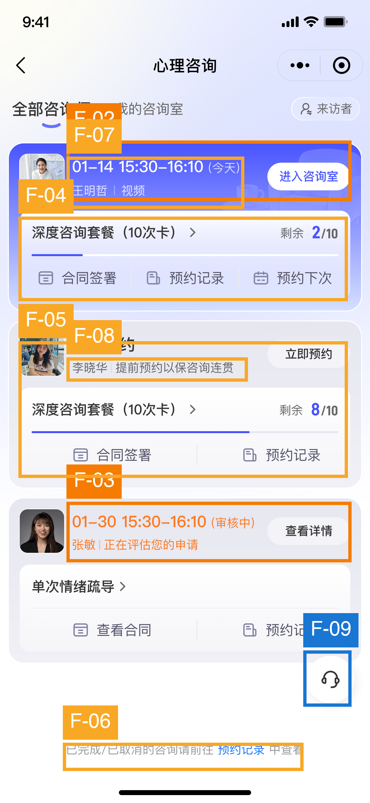

# UX Audit：心理咨询订单与预约列表

## 执行摘要

页面已经把“今天的预约”置于列表首位，并提供醒目的“进入咨询室”入口，核心任务具备可完成性。经产品方澄清，当前页面应选中“我的咨询室”；截图中的下划线位置是选中态呈现错误，不能据此认定用户进入了“全部咨询师”。最需要优先处理的是：为即将开始的咨询提供明确时间反馈与进入规则、为“审核中”补齐等待预期和后续路径；另外可优化订单状态的可扫描性。截图只能证明静态呈现；按钮反馈、禁用规则、提醒机制、异常处理等均作为建议，不假设已经存在。

## 范围与方法

- **评估目标：** 混合用户能够快速了解已下单咨询订单状态，并进入已有预约的心理咨询。
- **平台：** 微信小程序。
- **截图：** 1 张，`预约列表-全部.png`，预约/订单列表页。
- **重点：** 可用性问题、用户操作路径、交互反馈缺失、潜在交互机会。
- **框架：** Nielsen、Shneiderman、Gerhardt-Powals、Bastien & Scapin、Fogg B=MAP、行为定律、Gestalt、Norman、Tognazzini、WCAG 2.1 静态子集、内容设计启发式。
- **证据边界：** 只将截图中的可见内容作为现状证据；产品方已确认当前内容属于“我的咨询室”，顶部可见下划线是选中态错误，不代表真实导航位置。动态状态、点击热区、加载与延迟、消息通知、进入时限、错误反馈、取消或改期流程、焦点顺序、键盘和屏幕阅读器表现无法从截图判断。

## 问题总览

| ID | 优先级 | 检查项 | 问题摘要 | 主要依据 |
|---|---|---|---|---|
| F-02 | S3 高 | PROGRESS-BLIND | 今日咨询只展示时间和入口，缺少临近程度及进入规则 | Nielsen #1；Shneiderman #3；Fogg B=MAP |
| F-03 | S3 高 | STATE-GAP | “审核中”未说明预计时长、下一步和异常处理 | Nielsen #1/#9；Content #6/#7；Peak-End Rule |
| F-04 | S2 中 | HIERARCHY-FLAT | 单卡内入口过多，主任务与次级操作竞争 | Nielsen #8；G-P #8；Gestalt: Proximity |
| F-05 | S2 中 | PATTERN-DRIFT | 三张订单卡的状态与操作结构不一致，扫描成本高 | Nielsen #4/#6；B&S: Consistency |
| F-06 | S2 中 | TOUCH-TARGET | 历史订单入口位于页面最底部，弱化且不易发现 | Fitts's Law；WCAG 2.5.5；Tog: Discoverability |
| F-07 | S2 中 | RECALL-TAX | 日期表达缺少年份/明确相对日期，跨周期识别易出错 | Nielsen #2/#6；Content #7；G-P #2 |
| F-08 | S2 中 | CONTRAST-FAIL | 多处浅灰与半透明文字/图标可读性偏弱，需工具复核 | WCAG 1.4.3/1.4.11；Tog: Readability |
| F-09 | S1 低 | FAKE-AFFORDANCE | 悬浮客服按钮压在内容区域边缘，可能遮挡或误触 | Fitts's Law；Gestalt: Figure/ground |

## 截图标注

> 标注框可能重叠，因为多个问题作用于同一区域；编号与下方问题一一对应。

## 详细发现

### 更正记录：原 F-01 已撤销

产品方确认当前内容属于“我的咨询室”。截图中下划线落在“全部咨询师”一侧，是选中态标注错误。因此，原先关于当前页面导航归属和一级导航必须重命名的判断不成立；该问题不再计入审计发现。设计稿应将“我的咨询室”呈现为选中态，并核对标签文字、字重和下划线是否一致。这是设计稿状态校正，不据此推断线上交互缺陷。

### F-02｜即将开始的咨询缺少时间进度和进入条件反馈

- **当前问题 ➡️** 首卡显示“01-14 15:30–16:10（今天）”和“进入咨询室”，但截图中没有倒计时、距离开始多久、可提前多久进入、迟到规则或设备准备提示。
- **用户影响 ➡️** 用户虽然看见入口，仍需自己计算时间并猜测能否进入；若按钮尚不可用或需要授权，关键时刻更容易焦虑、反复点击或错过咨询。
- **推荐交互方案 ➡️** 以动态状态呈现“距开始 18 分钟 / 可进入 / 已开始 5 分钟”，在临近时将主卡提升为置顶待办；按钮随状态切换为“提前检测设备”“还有 18 分钟可进入”“进入咨询室”。点击后建议即时给出加载、权限检查、失败原因和重试入口。这里的按钮规则与反馈是建议，截图无法判断现状。
- **优先级 ➡️ S3 高。** 发生在时间敏感、情绪敏感的核心动作上。依据：Nielsen #1；Shneiderman #3/#4；Fogg B=MAP（Prompt 与 Ability）；Peak-End Rule。

### F-03｜“审核中”状态没有等待预期与恢复路径

- **当前问题 ➡️** 第三张卡以橙色显示“审核中 / 正在评估您的申请”，但没有可见的预计完成时间、审核内容、结果通知方式，也没有“补充资料/联系客服”等异常路径。“查看详情”语义较宽。
- **用户影响 ➡️** 用户无法判断是否需要行动、要等多久、错过什么；心理咨询场景下这种不确定性会放大焦虑，并引发重复查看或咨询客服。
- **推荐交互方案 ➡️** 在卡片内增加可预期状态：“预计 24 小时内完成，无需操作，结果将通过服务通知告知”；若确有用户待办，按钮明确改为“补充资料”。详情页建议提供进度节点、当前责任方、预计时间、超时后的求助入口；审核结果出现时提供清晰闭环与下一步 CTA。
- **优先级 ➡️ S3 高。** 影响状态理解与信任，也可能形成流程死角。依据：Nielsen #1、#9；Content #6、#7；B&S: Guidance/Feedback；Peak-End Rule。

### F-04｜卡片内操作过多，主次关系不足

- **当前问题 ➡️** 第一张卡同时包含“进入咨询室、套餐详情箭头、合同签署、预约记录、预约下次”至少 5 个可见动作；多个入口使用相近字号和横向权重。
- **用户影响 ➡️** “马上进入咨询”这一时间敏感任务仍需与管理型操作竞争注意力；用户也可能误触“预约下次”而不是进入当前咨询。
- **推荐交互方案 ➡️** 每张卡只保留一个与当前状态匹配的主 CTA，最多再留一个次级动作；合同、记录、套餐详情收进“更多”或卡片详情页。临近咨询时只突出“进入咨询室”，咨询结束后再切换为“预约下次/查看记录”。
- **优先级 ➡️ S2 中。** 当前核心 CTA 较醒目，问题可恢复，但重复出现会持续增加决策成本。依据：Nielsen #8；G-P #8；Gestalt: Proximity；Hick's Law。

### F-05｜相同订单卡的状态表达和操作布局漂移

- **当前问题 ➡️** 首卡使用蓝紫底与白色 CTA；第二、三卡用灰底。动作数量分别为 3、2、2；同一概念出现“合同签署/查看合同”“预约记录”，套餐行有时展示剩余次数、有时没有。“今天、暂无预约、审核中”也分别占据不同位置与视觉编码。
- **用户影响 ➡️** 用户必须逐卡重新学习信息结构，难以横向比较“哪个订单需要我现在处理”；新老用户都可能把视觉差异误解为功能规则差异。
- **推荐交互方案 ➡️** 建立固定卡片骨架：状态标签 → 最近时间/状态说明 → 咨询师与方式 → 套餐余量 → 单一主 CTA → 次级操作。用一致的状态标签组件和操作顺序；仅主 CTA 随状态变化，避免整卡结构频繁漂移。
- **优先级 ➡️ S2 中。** 不阻断任务，但显著增加重复扫描成本。依据：Nielsen #4、#6；B&S: Consistency；WCAG 3.2.4；Gestalt: Similarity。

### F-06｜历史订单入口隐蔽且远离主要浏览路径

- **当前问题 ➡️** “已完成/已取消的咨询请前往 预约记录 中查看”位于长页面底部，字体偏小，仅“预约记录”使用蓝色，整体不像明确按钮。
- **用户影响 ➡️** 有历史订单查询需求的用户需要滚到底部才能发现入口；文本中的小范围链接在移动端也可能难以准确点击。
- **推荐交互方案 ➡️** 将“历史记录”作为顶部状态筛选的一项，或在页面标题区提供稳定入口；若保留底部提示，将整行设为可点击列表项，使用“查看已完成与已取消咨询”及箭头，并确保触控区域至少 44pt。真实热区大小需在实现中验证。
- **优先级 ➡️ S2 中。** 影响次要但常见的查单任务。依据：Fitts's Law；WCAG 2.5.5；Tog: Discoverability；Content #3。

### F-07｜日期信息不足以支持跨周期判断

- **当前问题 ➡️** 日期仅写“01-14”“01-30”，没有年份；第一条额外写“今天”，第三条没有相对时间，且“审核中”的未来时间可能是申请时段还是已申请预约，含义不够明确。
- **用户影响 ➡️** 跨年、旧订单或审核延迟时，用户需要自行推断；对混合用户，日期与状态之间的关系不够直接。
- **推荐交互方案 ➡️** 最近 7 天优先使用“今天 15:30”“本周五 15:30”，跨周期显示“2026年1月30日”；在状态文案中明确时间语义，如“申请预约：1月30日 15:30，待审核”。
- **优先级 ➡️ S2 中。** 当前首条有“今天”可缓解，但其他订单仍存在识别风险。依据：Nielsen #2、#6；Content #7；G-P #2。

### F-08｜浅灰和半透明信息可能降低可读性

- **当前问题 ➡️** 顶部未选标签、卡片副文案、底部说明、浅紫色操作图标，以及蓝紫背景上的浅色文字视觉对比偏弱。
- **用户影响 ➡️** 户外、低亮度或视力较弱用户更难快速获取咨询师、方式、提示与次级操作；关键状态理解速度下降。
- **推荐交互方案 ➡️** 用设计稿或实现色值逐项做对比度检测；普通文本目标至少 4.5:1，大号文本和有意义 UI 图形至少 3:1。不要仅靠降低透明度表达次级信息，可同时使用字号、字重和层级。此处属于视觉判断，需用真实色值复核后才能认定是否不达标。
- **优先级 ➡️ S2 中。** 涉及多处高频信息，但截图不足以确认具体对比度。依据：WCAG 1.4.3、1.4.11；B&S: Legibility；Tog: Readability。

### F-09｜悬浮客服入口与内容区边界冲突

- **当前问题 ➡️** 右下客服悬浮按钮压在第三张卡的右下边缘附近，视觉上与卡片内容争夺前景层级。
- **用户影响 ➡️** 小屏、字体放大或内容变长时可能遮挡卡片操作；用户滚动或点击边缘内容时也存在误触风险。
- **推荐交互方案 ➡️** 为悬浮按钮预留固定安全区，避开卡片操作与底部提示；滚动时可缩小为贴边标签，停止滚动后恢复。需要在多机型和字体放大场景验证实际遮挡与热区。
- **优先级 ➡️ S1 低。** 当前截图未显示内容被完全遮挡，属于布局稳健性问题。依据：Fitts's Law；Gestalt: Figure/ground；Nielsen #8。

## 用户操作路径诊断

### 路径 A：了解订单状态

当前路径为“进入我的咨询室 → 逐卡扫描视觉差异 → 从日期/颜色/文案推断状态 → 必要时进入详情”。主要摩擦来自状态组件不统一、“审核中”缺少下一步。建议路径为“进入我的咨询室 → 默认看到最近待办 → 通过统一状态标签立即识别 → 一键执行当前状态对应动作”，历史订单可通过明确入口直接访问。

### 路径 B：进入预约咨询

当前路径为“找到蓝紫色首卡 → 确认今天和时间 → 点击进入咨询室”。入口足够醒目，但缺少距离开场、何时可进入、设备/权限准备及异常恢复等可见线索。建议在 T-30 分钟进入“即将开始”模式：置顶卡片、倒计时、设备检测、到点解锁主 CTA，并在失败时给出重试和联系客服。

### Fogg B=MAP

- **Motivation：** 心理咨询本身具有明确动机，但“审核中”的不确定性可能削弱信任和持续行动意愿。
- **Ability：** 进入按钮可见，基本能力门槛低；不过用户仍承担时间计算、状态解释和入口筛选的心理成本。
- **Prompt：** “进入咨询室”是有效提示；“暂无预约”和“审核中”对应提示不够具体，未明确“现在该做什么”。

## 交互反馈与状态建议

以下行为无法从静态截图确认，不作为现有缺陷事实；建议在原型或真机中逐项验证：

1. 点击“进入咨询室”后是否立即出现按压态与加载反馈；权限拒绝、网络失败、咨询师未上线时是否说明原因并提供解决办法。
2. 距开始较远时，按钮是否禁用；若禁用，是否明确显示开放时间，而不是让用户反复尝试。
3. 预约、取消、改期、审核完成后，卡片是否原位更新并提供成功确认与下一步。
4. 是否有微信服务通知或小程序内提醒；若有，应允许用户查看提醒状态与重新授权。
5. 空列表、加载、刷新失败、数据同步延迟、订单冲突和咨询结束状态是否有专门页面或卡片反馈。
6. 点击卡片空白区域、套餐行箭头、图标文字的真实热区与跳转范围是否一致。
7. 客服按钮是否遮挡内容、是否支持安全退出，以及紧急心理危机场景是否有明确的非普通客服指引。

## 做得好的地方

- **P-01：** 将“今天的预约”放在首卡并用更强视觉层级突出，有利于时间敏感任务；符合 Nielsen #1 与 Tog: Anticipation。
- **P-02：** “进入咨询室”“立即预约”“查看详情”均采用动词开头，比模糊的“确定/下一步”更易预测结果；符合 Content #3。
- **P-03：** 套餐剩余次数同时使用数字和进度条表达，降低用户计算成本；符合 G-P #7/#9。
- **P-04：** 咨询师头像、姓名、咨询方式与时间相邻，基本信息分组清晰；符合 Gestalt: Proximity。

## 优先实施建议

1. **高优先级：** 为最近预约补齐倒计时、进入开放时间、设备检查、加载与失败恢复。
2. **高优先级：** 将“审核中”改为可预期流程：预计时长、是否需要操作、通知方式、超时求助。
3. **中优先级：** 在“我的咨询室”内统一卡片结构与状态标签，收敛每卡操作数量，并让历史记录更易发现。
4. **中低优先级：** 验证对比度、触控面积和客服悬浮层在多机型/大字体下的表现。

## 框架覆盖

| 框架 | 相关发现 |
|---|---|
| Nielsen | F-02、F-03、F-04、F-05、F-07、F-09 |
| Shneiderman | F-02 |
| Gerhardt-Powals | F-04、F-07 |
| Bastien & Scapin | F-03、F-05、F-08 |
| Hick / Fitts / Peak-End | F-02、F-03、F-04、F-06、F-09 |
| Fogg B=MAP | F-02、F-03，另见路径诊断 |
| Cialdini | 未发现有充分截图证据的问题；不强行套用 |
| Gestalt | F-04、F-05、F-09 |
| Norman | 本次更正后无充分证据支持独立发现 |
| Tognazzini | F-06、F-08 |
| WCAG 2.1 静态子集 | F-05、F-06、F-08 |
| 内容设计 | F-03、F-06、F-07 |

## 无法从静态截图判断

焦点可见性、键盘操作、屏幕阅读器语义与朗读顺序、动态字体适配、横竖屏与重排、动画与减少动态效果、加载延迟、网络与权限错误、消息提醒、真实触控范围、按钮启用规则、取消/改期与撤销机制。

## 参考框架

Nielsen: nngroup.com/articles/ten-usability-heuristics · Shneiderman: cs.umd.edu/users/ben/goldenrules.html · Gerhardt-Powals: Int. J. HCI (1996) · Bastien & Scapin: INRIA RT-0156 (1993) · Laws: lawsofux.com · Fogg: behaviormodel.org · Norman: jnd.org · Tognazzini: asktog.com/atc/principles-of-interaction-design · WCAG: w3.org/WAI/WCAG21/quickref · Content design: contentdesign.london
