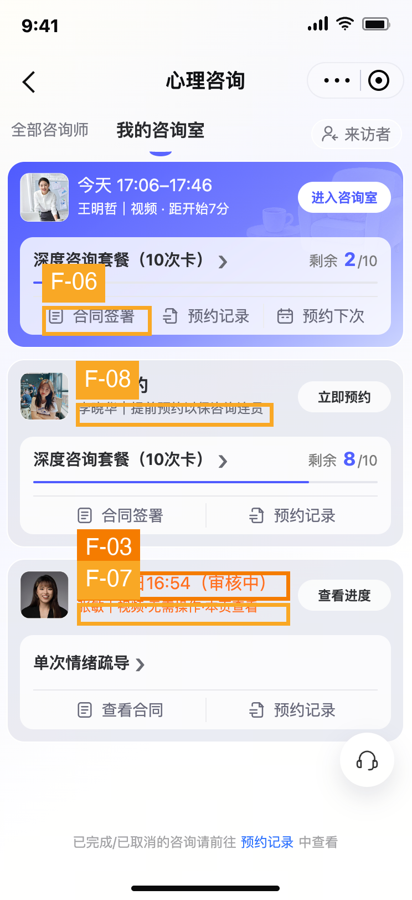

# “我的咨询室”当前页面截图专项交互审计

## 执行摘要

本轮仅审阅用户提供的最新截图，不打开本地链接、不测试按钮实际行为。页面已将即将开始的咨询、进入咨询室、套餐剩余和常用入口放在易扫描的位置；待预约按钮的视觉权重也适当降低。核心残留问题是审核中订单以“预计审核完成时间”占据主信息位，却没有在卡片上直接说明申请的咨询时段。另有合同动作与入室关系、审核微文案和待预约提示语三个中优先级的表达问题；这些是基于可见信息提出的交互方案，不推断真实后台状态。

## 范围与证据

- **用户任务：** 混合用户了解自己已下单咨询订单的状态，并快速进入已预约心理咨询。
- **平台：** 微信小程序。
- **唯一证据：** `assets/current.png`，显示“我的咨询室”选中、即将开始/暂无预约/审核中三类订单卡。
- **本轮排除：** 上轮 F-01、F-02、F-04、F-05（均不属于当前页面要改的内容）；客服悬浮按钮位置；底部历史记录入口；套餐右箭头的“展开/收起”解释（它是进入套餐详情）。
- **证据边界：** 没有测试真实签约状态、按钮反馈、审核通知、进房前置条件、日期变化或其他页面。截图没有展示“通知渠道待配置”，因此旧版 F-07 的那个具体结论不沿用。
- **主要启发式：** Nielsen #1/#2/#6/#8，G-P #2/#8，B&S: Guidance/Significance of codes，Norman: Conceptual model，Content #1/#7/#8/#9。

## 发现总览

| ID | 严重度 | 截图证据 | 问题 |
|---|---|---|---|
| F-03 | S3 高 | 第三张卡主行“预计明日16:54（审核中）” | 审核预计完成时间压过申请咨询时间 |
| F-06 | S2 中 | 第一、二张卡“合同签署”，第三张卡“查看合同” | 合同状态动作已区分，但与临近咨询的关系未交代 |
| F-07 | S2 中 | 第三张卡“视频·无需操作·本页查看” | 行动要求和查看对象不够明确 |
| F-08 | S2 中 | 第二张卡“暂无预约”“提前预约以保咨询连贯” | 提示语带压力，且未说明预约是否有时限 |

## 标注截图

## 逐项分析

### F-03｜审核卡缺少申请的咨询时间（S3 高）

- **当前问题 →** 第三张卡主行是“预计明日16:54（审核中）”，没有直接展示申请的咨询日期/时段。页面同时有“查看进度”按钮，但静态截图不能证明下一层是否包含申请时段。
- **用户影响 →** 用户浏览订单时无法直接核对“这笔申请约的是何时”；有多笔审核订单时更难区分，也可能把“预计明日16:54”误认为咨询开始时间。
- **推荐交互方案 →** 若订单有申请时段，把它放在卡片主行，例如“申请咨询：1月30日15:30–16:10”，旁边或下一行写“审核中”；“预计明日16:54前完成审核”降为次级信息。若尚未选择时段，明确写“咨询时间待确定”，不可虚构日期。相对日期跨天/跨年时补绝对日期。保持“查看进度”为次级动作。
- **优先级 → S3 高。** 直接影响识别订单状态；Nielsen #1/#6，Content #1，G-P #2。

### F-06｜签约动作与入室关系需明确（S2 中）

- **当前问题 →** 截图中第一、二张卡写“合同签署”，第三张卡写“查看合同”。这表明页面已经区分两种合同动作，不能说所有卡都错误地显示“签署”。但临近咨询的第一张卡同时显示“进入咨询室”和“合同签署”，画面没有交代签署是否为进入前置条件。
- **用户影响 →** 临近开始时，用户可能犹豫是否先去签约；如果需要先签，当前信息没有让人提前准备；如果不需要先签，两个相邻动作也没有说明优先关系。
- **推荐交互方案 →** 保留你确认的“合同签署 / 查看合同”两态。仅在签署确属入室前置条件时，在首卡的合同入口附近增加简短提示“进入咨询室前需签署”，并让未完成签约的进房动作提供明确引导；若非前置，就不加警示，维持“进入咨询室”为主动作、签约为次级动作。已签订单继续显示“查看合同”。
- **优先级 → S2 中，条件性。** 前置规则需业务确认；Nielsen #1/#5，Norman: Conceptual model，Content #7。

### F-07｜审核卡“无需操作·本页查看”缺少指代（S2 中）

- **当前问题 →** 第三张卡的次行写“张敏｜视频·无需操作·本页查看”。“无需操作”没有说当前无需做什么，“本页查看”没有说查看审核结果、预约安排还是服务进度；右侧又有“查看进度”。旧版提及的内部用语不在本截图，本条是独立的截图可见问题。
- **用户影响 →** 用户在等待审核时不能形成清楚预期，可能反复查看、误以为还要完成某项操作，或者忽略真正需要关注的审核结果。
- **推荐交互方案 →** 把状态与后续动作合并成具体一句：“审核中，暂不需要操作；审核结果可在本页查看。”如确有通知机制，再按真实机制写“结果将通过××通知”；未知时不作承诺。列表里保留“查看进度”作为查询入口，避免再次写模糊的“本页查看”。
- **优先级 → S2 中。** 信息确定性不足但不阻断主任务；Nielsen #2/#8，B&S: Significance of codes，Content #7/#9。

### F-08｜待预约卡的连续性提醒略带压力（S2 中）

- **当前问题 →** 第二张卡已清楚写“暂无预约”，旁边又写“提前预约以保咨询连贯”。截图没有显示必须在某个期限前预约，也没有说明预约机会会消失；“以保咨询连贯”容易被理解为不立刻预约会造成不良后果。
- **用户影响 →** 心理咨询场景中，尚在考虑时间安排的用户可能产生不必要的紧迫感。对只想确认订单状态的人来说，这句劝促信息也增加扫描负担。
- **推荐交互方案 →** 保留弱化后的“立即预约”按钮，把辅助语改为中性事实：“尚未预约下一次咨询”或“剩余8次，可选择时间预约”。仅当确有套餐到期、时段稀缺等真实约束时，才展示具体截止日期或规则，而不是笼统劝促。
- **优先级 → S2 中。** 属于信任与语气问题，不应盖过审核时段问题；Content #7/#8/#9，G-P #8。

## 从目标路径看

用户进入本页后，即将开始的预约排在首卡，“今天17:06–17:46”“距开始7分”和“进入咨询室”构成清晰的时间敏感提示（Fogg B=MAP 的 Prompt 可见）。截图无法验证点击后的权限、等待室、失败恢复，也不能从画面确认倒计时是否实时更新。看订单状态时，套餐剩余次数与进度条直接可见；唯一仍需优先补足的是审核订单的“申请咨询时间”。

## 做得好的地方

- **P-01：** “我的咨询室”初始选中态正确，符合当前任务的页面定位；Nielsen #4。
- **P-02：** 临近咨询的时间、倒计时和主按钮聚在首卡，主动作可快速识别；Tog: Anticipation。
- **P-03：** 套餐剩余次数、进度条和合同/预约记录/预约下次入口均直接可见，减少反复进入详情的负担；Nielsen #6/#7。
- **P-04：** 待预约卡的按钮是浅色次级形式，不与“进入咨询室”争夺主视觉；Gestalt: Similarity。
- **P-05：** 已有“合同签署”和“查看合同”两类文案，具备按状态表达的基础；Nielsen #1。

## 优先处理顺序

1. **先补审核申请时段：** 让第三张卡能被快速识别，审核预计完成时间降级。
2. **再明确合同与入室关系：** 只在真实前置条件存在时提醒，保留两类合同动作。
3. **收紧文案：** 将“无需操作·本页查看”说具体；待预约提醒改成中性事实，不制造无依据的紧迫感。

## 无法仅凭截图判断

按钮点击效果、合同是否真的必须在入室前签署、审核进度/通知机制、空与错误状态、倒计时更新、触控热区实际尺寸、读屏与焦点顺序、动画和加载反馈。以上不作为当前问题断言。

## 框架参考

Nielsen: nngroup.com/articles/ten-usability-heuristics · Bastien & Scapin: INRIA RT-0156 (1993) · Gerhardt-Powals: Int. J. HCI (1996) · Norman: jnd.org · Tognazzini: asktog.com/atc/principles-of-interaction-design · Fogg: behaviormodel.org · Content design: contentdesign.london
